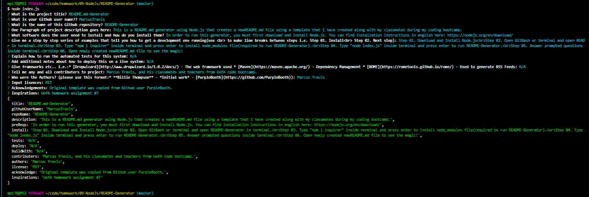

# README.md-Generator

   

## Table of Contents

* [Prerequisites](#prerequisites)
* [Installing](#Installing)
* [Running the tests](#running-the-tests)
* [Deployment](#deployment)
* [Built With](#built-with)
* [Contributing](#contributing)
* [Version](#version)
* [Authors](#authors)
* [License](#license)
* [Acknowledgements](#acknowledgements)

## Description

This is a README.md generator using Node.js that creates a newREADME.md file using a template that I have created along with my classmates during my coding bootcamp course at UofA.

### Prerequisites

In order to run this generator, you must first download and install Node.js. You can find installation instructions in english here: https://nodejs.org/en/download/

### Installing

Step 01. Download and Install Node.js 

## Running the tests

N/A

## Deployment

Step 01. Open GitBash or terminal and open README-Generator in terminal. 
Step 02. Type "npm i inquirer" inside terminal and press enter to install node_modules file(required to run README-Generator). 
Step 03. Type "node index.js" inside terminal and press enter to run README-Generator. Step 04. Answer prompted questions inside terminal. 
Step 05. Open newly created newREADME.md file to see the magic! 
 
 
 

## Built With

JavaScript

## Contributing

Marcus Travis, and his classmates and teachers from UofA code bootcamp.

## Version
(Update this as needed)
We use [SemVer](http://semver.org/) for versioning. For the versions available, see the [tags on this repository](https://github.com/your/project/tags). 

## Authors

Marcus Travis

## License

N/A

## Acknowledgments

Original template was copied from Github user PurpleBooth.
* Hat tip to anyone whose code was used
* Inspirations: UofA homework assignment #7
